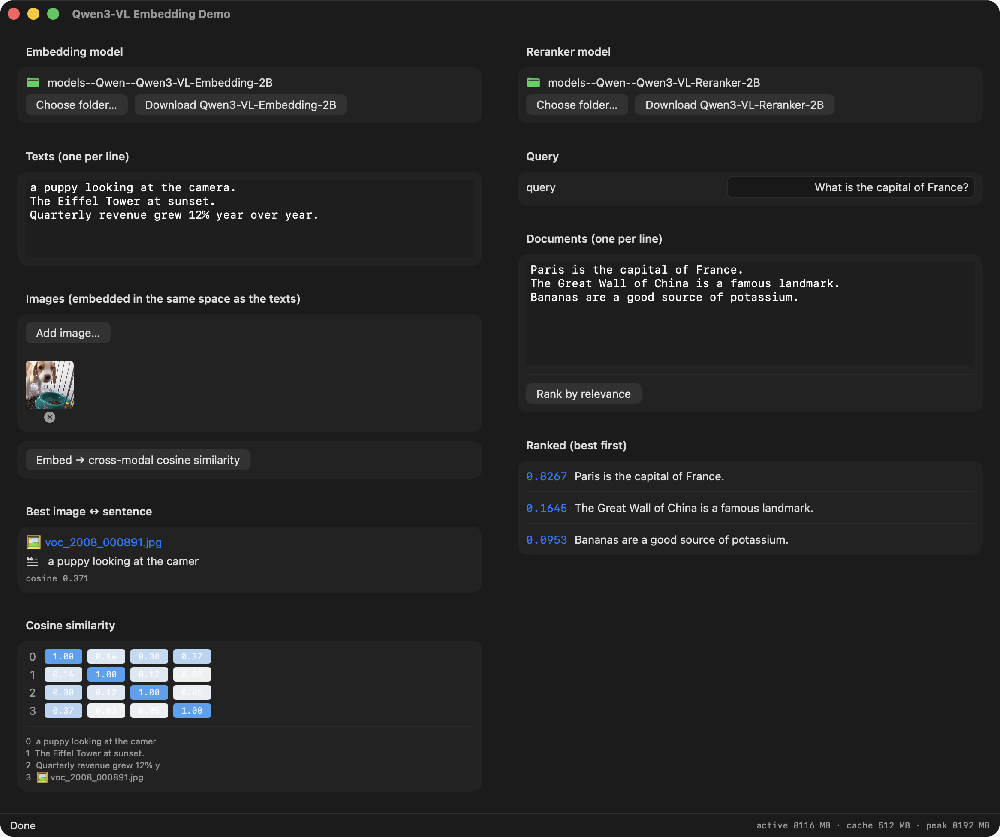

# mlx-swift-Qwen3-VL-Embedding

Apple-Silicon port of [QwenLM/Qwen3-VL-Embedding](https://github.com/QwenLM/Qwen3-VL-Embedding)
& Qwen3-VL-Reranker, built on [mlx-swift](https://github.com/ml-explore/mlx-swift) and
[mlx-swift-lm](https://github.com/ml-explore/mlx-swift-lm).



The Qwen3-VL **backbone** (vision tower + language model, DeepStack, interleaved-MRoPE, QK-norm)
already ships in `mlx-swift-lm` as `MLXVLM.Qwen3VL`. This package adds the two thin heads the
reference repo layers on top:

| Head | What it does | Needs vendored backbone? |
|---|---|---|
| **Embedder** | last-token (EOS) pooling of `last_hidden_state` → L2-normalize → optional Matryoshka (MRL) truncation | Yes — the public `Qwen3VL` exposes only logits, not the pre-`lm_head` hidden state |
| **Reranker** | `sigmoid(logits[yes] − logits[no])` at the last position | No — uses stock `MLXVLM.Qwen3VL` logits directly |

A single library-side `Qwen3VLEmbeddingSession` drives both the `qwen3vl-embed` CLI and the SwiftUI
demo app (the *shared-driver* pattern). Text, image, and cross-modal embeddings are supported.

## Status

Text embeddings, image embeddings, and reranking are **numerically validated** against the
PyTorch/transformers reference (enforced by `ParityTests`):

| Path | Parity vs Python reference |
|---|---|
| Reranker score | \|Δ\| < 0.0064 |
| Text embedding (cosine) | ≥ 0.9997 |
| Image embedding (cosine) | ≥ 0.997 |

See `Sources/MLXQwen3VLEmbedding/Vendored/VENDORED.md` for the vendored backbone provenance and the
local fixes (notably a `gelu_pytorch_tanh` vision-MLP fix that should be reported upstream).

## Usage (`Qwen3VLEmbeddingSession`)

```swift
import MLXQwen3VLEmbedding

let embedder = try await Qwen3VLEmbeddingSession.load(
    .init(modelDirectory: embeddingModelURL, task: .embedding))
let textVecs = try await embedder.embed(texts: ["a golden retriever puppy", "the Eiffel Tower"])
let imageVec = try await embedder.embed(.image(cgImage))            // same space as text

let reranker = try await Qwen3VLEmbeddingSession.load(
    .init(modelDirectory: rerankerModelURL, task: .reranker))
let ranked = try await reranker.rankedDocuments(
    query: .text("capital of France"),
    documents: [.text("Paris is the capital of France."), .text("Bananas are yellow.")])
```

## CLI

```sh
qwen3vl-embed embed  --model <Embedding-2B-dir> "a dog" "a cat" --image photo.jpg
qwen3vl-embed rerank --model <Reranker-2B-dir>  "capital of France" "Paris is the capital." "…"
qwen3vl-embed bench  --model <Embedding-2B-dir> --iterations 20   # throughput + leak watch
```

## Build & test

```sh
xcodebuild -scheme mlx-swift-qwen3vl-embedding-Package -destination 'platform=macOS' \
  -derivedDataPath .xcdd build
xcodebuild -scheme mlx-swift-qwen3vl-embedding-Package -destination 'platform=macOS' test
```

Use `xcodebuild` (not `swift test`, which can't load MLX's Metal library). The parity tests
auto-discover models from the Hugging Face cache and skip cleanly when absent.

## Documentation

DocC reference docs: `Scripts/build_docs.sh` emits a static site to `docs/`
(`Scripts/build_docs.sh preview` for live reload).

## Weights

Point the session at a local snapshot of `Qwen/Qwen3-VL-Embedding-2B` (or `-Reranker-2B`, or the
8B variants). bf16 HuggingFace safetensors load directly — no separate conversion step. The
embedding model's chat template appends `<|endoftext|>` as the pooled EOS token (handled
automatically).

## License

[MIT](LICENSE) © 2026 Hiroaki Yamane.

This package vendors a modified copy of the Qwen3-VL model from
[`ml-explore/mlx-swift-lm`](https://github.com/ml-explore/mlx-swift-lm) (MIT) and is a port of the
[Qwen3-VL-Embedding](https://github.com/QwenLM/Qwen3-VL-Embedding) reference (Apache-2.0). See
[`NOTICE`](NOTICE) for attributions and `Sources/MLXQwen3VLEmbedding/Vendored/VENDORED.md` for the
vendored-backbone provenance and modifications. Model weights are distributed separately by their
authors under their own licenses.
